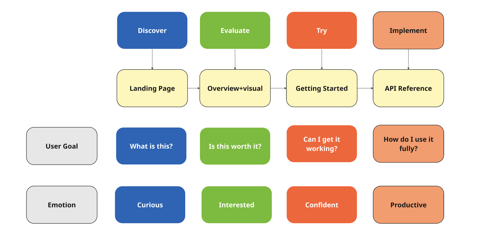

# Context and Design Decisions

*This section documents the research and key findings for the Tech Debt Tracker API and why it was chosen.*

## Research foundation:

- A mockup API gives the right balance of creativity without constraint when it comes to documentation.
- Most teams don't have a clear visibility of their technical debt nor knowledge of how much time to fix it.
- Technical debt is a present reality in all companies that work with coding, and its extremely important that it’s tracked and understood.

## Design rationale:

- Developers generally prefer visual overviews before diving into technical details
- Severity scales beyond 5 levels tend to cause decision fatigue
- Technical debt estimates become less accurate over time—this informed the auto-growing estimate feature
- Authentication is a common pain point in API documentation

## Content Strategy Decisions:

*This section documents the API decisions and the rationale behind every statement.*

| **Decision** | **Rationale** | **Evidence** |
| --- | --- | --- |
| Severity scale limits 1-5 | A range of numbers bigger than that causes analysis paralysis.  | Industry best practice |
| Growing estimate time based on severity and date | The older the technical debt, the harder it is to fix it.  | Common developer experience |
| Quick Visual section placed early | Developers want to see value before reading details | Documentation best practice |
| Consistent endpoint structure | Reduces learning time across endpoints | Standard API doc pattern |
| curl examples only | Works for all developers regardless of language | Universal compatibility |

**Goals, signals and measures**

| **Goal** | **Measure** | **Measure** |
| --- | --- | --- |
| Fast onboarding | Time to first successful API call | < 5 minutes |
| Self-service | Users resolve errors without support | 80% self-resolution |
| Findability | Users locate information quickly | < 30 seconds |
| Comprehension | Users understand estimate growth concept | > 85% accuracy |

## Information Architecture Choices:

## Accessibility Considerations

This section documents the accessibility considerations when deciding the documentation design.  

| **Element** | **Approach** |
| --- | --- |
| Error messages | Include actionable steps, not just code. |
| Hierarchy | Semantic heading levels (H1 → H2 → H3) |
| Code blocks | High contrast syntax highlighting; not colour-dependent |
| Coded colours | Helps identify error and success messages  |
|  |  |

## Journey Map : Developer Onboarding

## API Workflow
